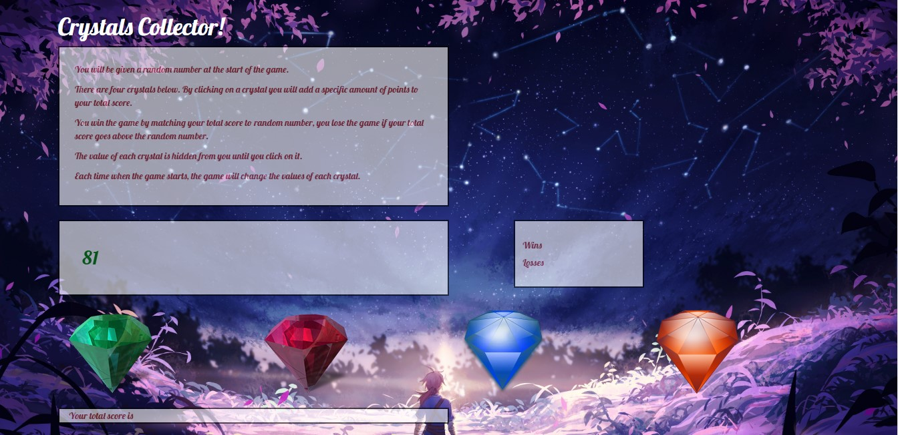

# The Crystals Collector Game - A fun, inveractive game of hidden values!!!

**How to Play!**

In this game, the player will be shown a randomly generated number between 19 - 120.  There will be four crystals desplayed upon launch, each containing a hidden value.  As the player clicks on the crystals, their score will be updated in increments that are equal to the crystals hidden values.  

The player will continue to click on the crystals, as they see fit, in order to attempt to equal the randomly generated number shown at the start of the game.  If the player's guesses total more then the randomly generated number, the player will lose that game.  If the player correctly obtains the exact value of the random number, the player will win.

The player can play as many times as they like and the game will keep track of their total wins and losses.

**Check it out for yourself!**
[CrystalsCollectorGame](https://andrealabis.github.io/unit-4-game)

# The Look!

